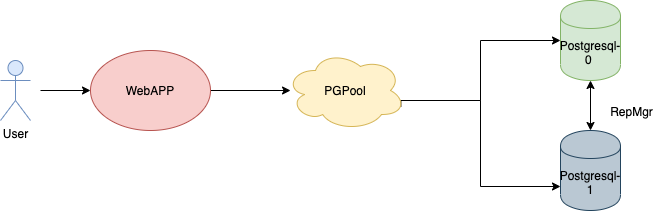

# webapp
A simple WebApp API that connects to Postgresql HA Database

### Helm chart can be installed using the following command: 
```helm install ./webapp --name webapp```
This installs a simple webapp that connects to a highly available Postgresql database. 

## Architecture
	

## How does it work ?
  Once the chart is installed, you will be able to access the service via the configured ingress in the webservice.
  Now lets hit a url which is not present in the DB - curl -v http://<svc-url>/pingpong! --> Returns 404
  Lets add a url to the DB - curl -X POST http://<svc-url>/ -d "full_url=https://redhat.com" --> Returns EZpNfRi
  Now lets hit the url added to the DB
  curl -X GET http://svc-url/EZpNfRi -v
*   Trying 192.168.99.100...
* Connected to 192.168.99.100 (192.168.99.100) port 31317 (#0)
> GET /EZpNfRi HTTP/1.1
> Host: 192.168.99.100:31317
> User-Agent: curl/7.43.0
> Accept: */*
>
< HTTP/1.1 307 Temporary Redirect
< Location: https://redhat.com
< Content-Length: 0
< Content-Type: text/plain; charset=utf-8

